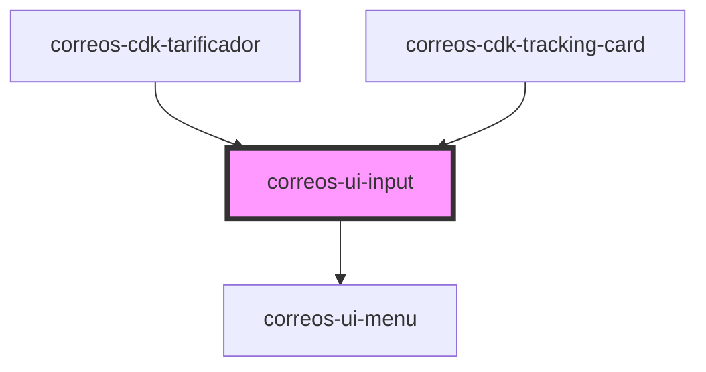

# correos-ui-input

<!-- Auto Generated Below -->

## Properties

| Property      | Attribute     | Description                                                | Type      | Default     |
| ------------- | ------------- | ---------------------------------------------------------- | --------- | ----------- |
| `autofocus`   | `autofocus`   | Flag para indicar que coja el foco al renderizarse         | `boolean` | `undefined` |
| `icon`        | `icon`        | Icono a mostrar en el encabezado                           | `string`  | `undefined` |
| `label`       | `label`       | Valor de la etiqueta                                       | `string`  | `'Label'`   |
| `maxlength`   | `maxlength`   | Carácteres máximos que debe tener el valor del campo input | `string`  | `undefined` |
| `minlength`   | `minlength`   | Carácteres mínimos que debe tener el valor del campo input | `string`  | `undefined` |
| `options`     | `options`     | Flag para indicar que coja el foco al renderizarse         | `string`  | `undefined` |
| `pattern`     | `pattern`     | Patrón de validación                                       | `string`  | `undefined` |
| `placeholder` | `placeholder` | Texto del marcado o información del campo                  | `string`  | `undefined` |
| `required`    | `required`    | Flag para indicar la obligatoriedad del campo              | `boolean` | `undefined` |
| `type`        | `type`        | Tipo del campo input                                       | `string`  | `'text'`    |
| `value`       | `value`       | Valor del campo input                                      | `string`  | `undefined` |

## Events

| Event         | Description            | Type               |
| ------------- | ---------------------- | ------------------ |
| `eventChange` | Descripción del evento | `CustomEvent<any>` |

## Dependencies

### Used by

 - [correos-cdk-tarificador](../correos-cdk-tarificador)
 - [correos-cdk-tracking-card](../correos-cdk-tracking-card)

### Depends on

- [correos-ui-menu](../correos-ui-menu)

### Graph

----------------------------------------------

*Built with [StencilJS](https://stenciljs.com/)*
