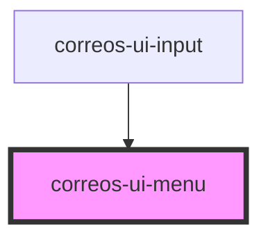

# correos-ui-menu

<!-- Auto Generated Below -->

## Properties

| Property         | Attribute | Description                                                              | Type               | Default     |
| ---------------- | --------- | ------------------------------------------------------------------------ | ------------------ | ----------- |
| `elementClicked` | --        | Funtión a lanzar cuando se hace click sobre un elemento pasando el valor | `Function`         | `undefined` |
| `opened`         | `opened`  | Flag para abrir inicialmente el menú                                     | `boolean`          | `undefined` |
| `options`        | `options` | Set de opciones a mostrar en el menú                                     | `string`           | `undefined` |
| `parent`         | --        | Elemento HTML padre sobre el cual asignar el origen del menú             | `HTMLInputElement` | `undefined` |
| `value`          | `value`   | Valor del campo input                                                    | `string`           | `undefined` |

## Methods

### `close() => Promise<void>`

Metodo para ocultar el menú

#### Returns

Type: `Promise<void>`

### `isOpened() => Promise<boolean>`

Metodo parasaber estado actual del menú

#### Returns

Type: `Promise<boolean>`

### `open() => Promise<void>`

Metodo para mostrar el menú

#### Returns

Type: `Promise<void>`

### `toggle() => Promise<void>`

Metodo para cambiar el estado de la visiblidad del menú

#### Returns

Type: `Promise<void>`

## Dependencies

### Used by

 - [correos-ui-input](../correos-ui-input)

### Graph

----------------------------------------------

*Built with [StencilJS](https://stenciljs.com/)*
